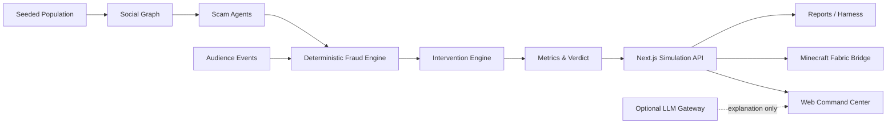

<div align="center">


<br />

**在真实世界部署反诈干预之前，先在一座可复现的 AI 城市中验证它。**

*Test fraud interventions on a synthetic society before deploying them in the real world.*

<br />

[](https://nextjs.org/)
[](https://www.typescriptlang.org/)
[](https://fabricmc.net/)
[](#双模式运行)
[](#安全与边界)

[快速开始](#快速开始) · [功能](#核心能力) · [演示流程](#三分钟演示) · [API](#api-控制面) · [Minecraft](#minecraft-空间投影) · [项目文档](#项目文档)

</div>

---

## ScamCity 是什么？

**ScamCity** 是一个离线优先、可解释、可复现的 AI 社会仿真实验室。它生成一座由 **100 位合成市民、5 个诈骗 Agent 和一张社会关系网**组成的城市，让研究者在相同 seed 下观察诈骗传播、注入突发事件，并比较不同反诈干预的效果、误报与成本。

它不是现实世界预测系统，也不评价真实个人。ScamCity 的目标是把一个问题变得可见：

> 当 Mass Warning、Bank Risk Agent、Social Guardian 或 Network Intervention 被部署后，谁被保护了，代价是什么，结果是否可以复盘？

## 核心能力

<table>
<tr>
<td width="50%" valign="top">

### 🏙️ 可复现的合成城市

- 固定 seed 生成 100 位虚构市民
- 家人、朋友、同事和邻居关系图
- 压力、信任、数字素养等可解释变量
- RNG 状态可序列化，相同输入可重复运行

</td>
<td width="50%" valign="top">

### 🎭 多阶段诈骗模拟

- 虚假客服、投资、冒充、权威与钓鱼链接
- `safe → suspicious → engaged → trusted → clicked → victim`
- 每次决策记录概率、风险因素和事件轨迹
- 损失、漏斗、预警、误报与安全指数实时更新

</td>
</tr>
<tr>
<td width="50%" valign="top">

### 🛡️ 干预对照实验

- Mass Warning
- Bank Risk Agent
- Social Guardian
- Network Intervention
- 同 seed 七日重放，统一比较 impact / friction / cost

</td>
<td width="50%" valign="top">

### 🔌 Web、API 与 Minecraft 同步

- Next.js 控制台与结构化命令 API
- Web `LIVE API` 与 Minecraft 读取同一快照
- snapshotId、cursor、schemaVersion 全链路可追踪
- API 故障时明确切换到 `LOCAL DEMO` / `DEMO`

</td>
</tr>
</table>

此外，项目还包含：

- **结构化观众事件**：银行故障、深伪声音、市场恐慌；白名单、有限影响且支持幂等重试；
- **受约束干预 Agent**：只允许从既有策略中观察、选择和激活，不允许任意执行工具；
- **可选 LLM 叙述**：让合成市民解释自己的决策，模型失败时自动回退到确定性规则；
- **现场诊断与报告**：自动检查 API、快照、Minecraft Bridge，并生成可复核实验摘要。

## 系统架构



核心模拟与展示层分离：规则引擎负责事实、指标和结果，LLM 只负责可选的解释与建议，不会替代确定性主判定。

## 快速开始

### 环境要求

- Node.js 18+
- npm
- 可选：Minecraft Java 1.21.11、Fabric Loader 0.19.3、Java 21

### 启动 Web 演示

```bash
git clone https://github.com/lavine888/ScamCity.git
cd ScamCity
npm install
npm run dev
```

打开 [http://localhost:3000](http://localhost:3000)。默认进入完全离线的 `LOCAL DEMO`，不需要数据库、API Key 或外部服务。

如果需要连接 Minecraft，推荐改用：

```bash
npm run serve
```

`serve` 会选择可用端口并发布端点发现文件，避免 Minecraft 的 `Open to LAN` 占用 3000 端口。

### 验证项目

```bash
npm run typecheck
npm run lint
npm run build
npm run doctor
npm run report
```

更完整的模拟契约与 Bridge 检查：

```bash
node scripts/verify-simulation-contract.mjs
node bridge-harness/verify.mjs
node minecraft-bridge/verify-command-format.mjs
```

## 双模式运行

| 模式 | 状态来源 | 适用场景 |
| --- | --- | --- |
| `LOCAL DEMO` | 浏览器内确定性模拟器 | 断网、快速预览、演示回退 |
| `LIVE API` | Next.js 进程内 SimulationStore | Web 与 Minecraft 共享同一实验 |
| Minecraft `DEMO` | Bridge 内置离线快照 | Web API 不可用时的空间演示 |

页面始终显示当前来源。离线结果不会被伪装成 Live API 结果。

## 三分钟演示

1. 使用 seed `42` 重置城市，观察 100 位市民和 5 个诈骗 Agent；
2. 推进模拟，查看诈骗从接触、信任到转账的漏斗；
3. 注入一个 `deepfake-voice` 观众事件；
4. 激活 **Social Guardian**，观察可信家属如何中断风险行为；
5. 使用同一 seed 比较五种策略的损失、受害人数、误报与成本；
6. 在 Minecraft 中刷新同一 snapshot，展示空间投影与统一 verdict。

完整现场步骤、回退方案和验收清单见 [`evolution/RUNBOOK.md`](evolution/RUNBOOK.md)。

## API 控制面

### 读取当前快照

```http
GET /api/simulation
```

### 执行命令

```http
POST /api/simulation
Content-Type: application/json
```

```json
{ "type": "reset", "seed": 42 }
```

支持的命令包括：

```text
reset · tick · run · pause · resume · intervention · compare · inject-event
```

注入一个有界、可重试的观众事件：

```json
{
  "type": "inject-event",
  "eventId": "audience-01",
  "event": {
    "type": "deepfake-voice",
    "duration": 72,
    "label": "Audience event: deepfake voice spreads"
  }
}
```

`eventId` 相同的重试不会重复生效。健康与版本元数据由 `GET /api/health` 提供。

### 受约束干预 Agent

```http
POST /api/agent/intervene
Content-Type: application/json
```

```json
{
  "budget": 1000,
  "expectedSnapshotId": "42-0-2-0"
}
```

Agent 只会调用白名单干预工具；如果决策期间城市已改变，接口返回 `409 STALE_SNAPSHOT`，不会应用过期决策。

## Minecraft 空间投影

Fabric Bridge 将 Live API 快照投影为 Minecraft 中的 10×10 市民风险网格、诈骗 Agent、事件区和控制塔 HUD。

```text
/scamcity refresh
/scamcity start
/scamcity status
/scamcity api
/scamcity intervene social-guardian
/scamcity style blocks
/scamcity style people
/scamcity clear
```

市民位置按 ID 稳定映射，快照顺序变化不会让整座城市跳位；增量渲染只更新发生变化的槽位。安装、构建与版本边界见 [`minecraft-bridge/README.md`](minecraft-bridge/README.md)。

## 可选 LLM 叙述

默认模拟完全不依赖 LLM。如果需要启用 OpenAI-compatible 网关：

```bash
cp .env.example .env.local
```

```env
LLM_ENABLED=true
OPENAI_API_KEY=your_key_here
OPENAI_BASE_URL=https://your-openai-compatible-endpoint/v1
OPENAI_MODEL=your-model-id
```

然后运行：

```bash
npm run llm:check
npm run dev
```

`04 / CITIZEN NARRATION` 面板只在 `LIVE API` 模式开放，避免浏览器本地世界与服务端世界发生叙述错配。所有输出都会标记为 `MODEL`、`RULES` 或 `FALLBACK`。

> **安全提示：** 不要提交 `.env.local`，不要把真实 API Key 写入源码、截图或实验报告。

## 项目结构

```text
app/                 Next.js 页面与 API routes
components/          Web 控制台与 UI adapter
simulation/          可复现模拟、社会图、事件与干预规则
agents/              诈骗、守护、研究与可选 LLM adapter
lib/                 Live API 状态存储
minecraft-bridge/    Fabric 客户端桥接模组
bridge-harness/      Bridge 快照和增量渲染验证
scripts/             契约、诊断、报告与运行工具
evolution/           审计、运行手册和重塑记录
```

## 设计原则

- **Reproducible first**：seed、RNG 状态、snapshotId 和事件 cursor 可追踪；
- **Rules own the truth**：受害、损失和 verdict 来自规则引擎，而不是模型自由生成；
- **Graceful degradation**：API 或模型不可用时仍可演示，并明确标注回退来源；
- **Bounded interaction**：事件和干预均使用白名单及预算约束；
- **Explain before optimize**：同时展示效果、误报和成本，不把单次运行包装成普遍结论。

## 安全与边界

- 所有市民、行为、消息和结果均为**合成数据**；
- 本项目不是现实人口预测、信用评分或执法决策系统；
- 模型参数未针对真实人群校准，输出只能称为 *synthetic modeled outcome*；
- API store 当前位于进程内，服务重启后会回到默认世界；
- LLM 是可选解释层，超时、无效响应和上游错误都会回退到规则系统；
- 不要向模拟器或外部模型发送真实个人数据、密钥或敏感案件材料。

## 项目文档

| 文档 | 内容 |
| --- | --- |
| [`evolution/RUNBOOK.md`](evolution/RUNBOOK.md) | 现场启动、演示、诊断与回退 |
| [`evolution/POST_RESHAPE_STATUS.md`](evolution/POST_RESHAPE_STATUS.md) | 当前能力与验证证据 |
| [`evolution/PRODUCT_AUDIT.md`](evolution/PRODUCT_AUDIT.md) | 重塑前产品审计及状态标注 |
| [`minecraft-bridge/README.md`](minecraft-bridge/README.md) | Fabric Bridge 构建与命令 |
| [`bridge-harness/README.md`](bridge-harness/README.md) | Bridge 验证工具 |

## Roadmap

- [ ] SQLite 实验持久化、快照分支与历史回放
- [ ] 更强的社会传播图与干预路径可视化
- [ ] 多 seed 批量实验和置信区间报告
- [ ] 浏览器与 Minecraft 的自动化端到端验收
- [ ] 可导入的标准化诈骗场景包
- [ ] LLM 模型对照评测与调用可观测性

---

<div align="center">

**ScamCity — simulate first, intervene responsibly.**

[Repository](https://github.com/lavine888/ScamCity) · [Runbook](evolution/RUNBOOK.md) · [Minecraft Bridge](minecraft-bridge/README.md)

</div>
