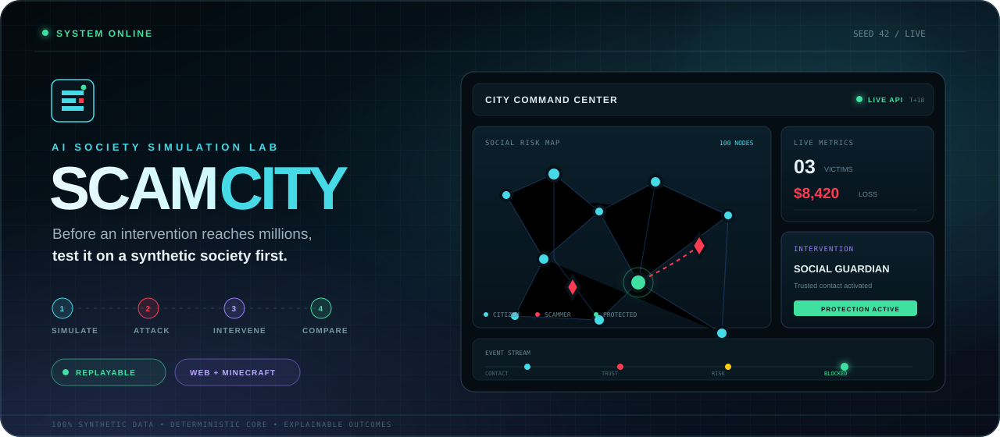
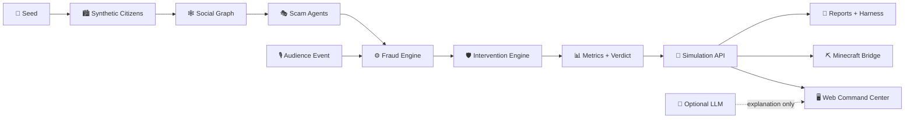

<div align="center">



<br />

# ScamCity

### 在干预触达真实世界之前，先在可复现的 AI 社会里验证它。

*A seeded, explainable fraud-intervention sandbox spanning Web, API and Minecraft.*

<br />

[](https://github.com/lavine888/ScamCity/actions/workflows/ci.yml)
[](https://nextjs.org/)
[](https://www.typescriptlang.org/)
[](minecraft-bridge/README.md)
[](#-双模式运行)

[🚀 立即运行](#-60-秒启动) · [🎬 三分钟演示](#-三分钟故事线) · [🧪 实验能力](#-你可以做什么实验) · [🎮 Minecraft](#-把实验搬进-minecraft) · [📚 文档](#-继续探索)

</div>

---

## 🧭 一句话理解

> **ScamCity = 一座能重置、分支、攻击和保护的合成城市。**

它生成 **100 位虚构市民**、**5 个诈骗 Agent** 和一张社会关系网。你可以让骗局在城市中展开，注入深伪声音或市场恐慌，再用同一个 seed 重放不同干预策略，回答三个问题：

<div align="center">

| 🔎 发生了什么？ | 🛡️ 哪种干预有效？ | ⚖️ 代价是什么？ |
| :---: | :---: | :---: |
| 从接触、信任到转账的完整轨迹 | 同 seed 比较四种反诈策略 | 损失、受害、误报与成本一起看 |

</div>

ScamCity **不是现实个人预测工具**。所有人、消息和结果均为合成数据；结论只代表当前规则与 seed 下的 *synthetic modeled outcome*。

---

## ✨ 为什么它有趣？

<table>
<tr>
<td width="50%" valign="top">

### 🏙️ 城市不是一张静态图

每位市民都有年龄、职业、资产、压力、孤独感、数字素养、冲动程度和信任渠道。他们通过家人、朋友、同事与邻居关系相互影响。

**相同 seed + 相同事件序列 = 可重复的城市。**

</td>
<td width="50%" valign="top">

### 🎭 骗局有一条可见的路径

```text
safe → suspicious → engaged
     → trusted → clicked → victim
                         ↘ protected
```

每一步都会留下概率、风险因素、消息和事件记录，而不是只给一个神秘分数。

</td>
</tr>
<tr>
<td width="50%" valign="top">

### 🛡️ 干预不是“魔法按钮”

| 策略 | 机制 | 典型代价 |
| --- | --- | --- |
| Mass Warning | 全城预警 | 警告疲劳 |
| Bank Risk Agent | 延迟异常转账 | 误报与摩擦 |
| Social Guardian | 联系可信家属 | 依赖社会关系 |
| Network Intervention | 从中心节点扩散 | 覆盖不均 |

</td>
<td width="50%" valign="top">

### 🎮 一份实验，两个展示面

Web 控制塔负责观察、操作与比较；Minecraft Bridge 把同一个 API 快照投影成 10×10 城市网格。

```text
Web action → Simulation API
           → snapshotId / cursor
           → Minecraft refresh
```

</td>
</tr>
</table>

---

## 🚀 60 秒启动

### 1 · 获取并安装

```bash
git clone https://github.com/lavine888/ScamCity.git
cd ScamCity
npm install
```

### 2 · 启动控制塔

```bash
npm run dev
```

打开 **[http://localhost:3000](http://localhost:3000)**。默认进入 `LOCAL DEMO`：无需数据库、无需 API Key、断网也能运行。

### 3 · 做一次快速实验

```text
RESET CITY → START SIMULATION → STEP
→ SOCIAL GUARDIAN → COMPARE STRATEGIES
```

<details>
<summary><strong>需要连接 Minecraft？</strong></summary>

<br />

请改用：

```bash
npm run serve
```

它会自动选择可用端口并发布发现文件。不要强制使用 3000：Minecraft 的 `Open to LAN` 可能占用该端口。

完整步骤见 [`evolution/RUNBOOK.md`](evolution/RUNBOOK.md)。

</details>

<details>
<summary><strong>想先确认环境是否健康？</strong></summary>

<br />

```bash
npm run typecheck
npm run lint
npm run build
npm run doctor
npm run report
```

深度契约检查：

```bash
node scripts/verify-simulation-contract.mjs
node bridge-harness/verify.mjs
node minecraft-bridge/verify-command-format.mjs
```

</details>

---

## 🎬 三分钟故事线

<table>
<tr><th width="12%">时间</th><th width="23%">章节</th><th>你会看到什么</th></tr>
<tr><td><strong>0:00</strong></td><td>🏙️ 城市上线</td><td>seed 42 生成 100 位市民与社会关系网；五个诈骗 Agent 开始寻找目标。</td></tr>
<tr><td><strong>0:30</strong></td><td>🎣 骗局展开</td><td>市民从接触走向信任、点击和转账；事件流解释每一步为什么发生。</td></tr>
<tr><td><strong>1:00</strong></td><td>🎙️ 观众出题</td><td>注入 <code>deepfake-voice</code>，观察冒充诈骗的有界风险增幅。</td></tr>
<tr><td><strong>1:30</strong></td><td>🛡️ 家属介入</td><td>激活 Social Guardian，让可信家属尝试中断高风险行为。</td></tr>
<tr><td><strong>2:10</strong></td><td>⚖️ 同城重放</td><td>相同 seed 下比较 Baseline 与四种干预的 impact / friction / cost。</td></tr>
<tr><td><strong>2:40</strong></td><td>🎮 空间投影</td><td>Minecraft 刷新同一 snapshot；Web 与游戏显示同一个实验 cursor。</td></tr>
</table>

> 演示失败也有退路：`LIVE API` → `LOCAL DEMO` → Minecraft `/scamcity demo`。每条回退路径都会明确标注来源，不冒充在线结果。

---

## 🧪 你可以做什么实验？

### A. 改变骗局发生的世界

三个白名单观众事件会对指定诈骗策略产生**有限、可解释**的影响：

| 事件 | 主要影响 | 模型效果 |
| --- | --- | --- |
| `bank-outage` | 虚假客服、权威诈骗 | 提高受影响策略的易感度 |
| `deepfake-voice` | 冒充诈骗 | 增加社会证明与易感度 |
| `market-panic` | 虚假投资 | 增加易感度与转账金额倍率 |

```json
{
  "type": "inject-event",
  "eventId": "audience-01",
  "event": {
    "type": "deepfake-voice",
    "duration": 72,
    "label": "Audience event: deepfake voice spreads"
  }
}
```

同一个 `eventId` 重试不会重复生效。

### B. 比较干预，而不是只看“冠军”

```text
IMPACT                     FRICTION                 COST
受害人数 / 金钱损失   +    误报 / 警告疲劳    +    激活成本
```

统一 verdict 规则是：**先减少损失，再减少受害，在误报可接受时解释成本**。页面、API、报告和 Minecraft HUD 使用同一套口径。

### C. 让受约束 Agent 提建议

```http
POST /api/agent/intervene
Content-Type: application/json
```

```json
{
  "budget": 1000,
  "expectedSnapshotId": "42-0-2-0"
}
```

Agent 只允许执行既有白名单干预。若决策期间城市发生变化，接口返回 `409 STALE_SNAPSHOT`，不会把过期决定写入新世界。

---

## 🧩 系统如何工作？



### 一条重要边界

```text
规则引擎拥有事实                  LLM 负责可选解释
─────────────────                ──────────────
✓ 谁受害                          ✓ 第一人称市民叙述
✓ 损失多少钱                      ✓ 实验摘要
✓ 干预是否成功                    ✓ 干预建议说明
✓ 哪个 verdict 胜出               ✗ 不改写模拟事实
```

---

## 🔌 API 游乐场

<details open>
<summary><strong>读取当前城市</strong></summary>

```http
GET /api/simulation
GET /api/health
```

快照包含 `schemaVersion`、`snapshotId`、seed、tick、事件 cursor、市民、诈骗者、指标和 verdict。

</details>

<details>
<summary><strong>控制模拟</strong></summary>

```http
POST /api/simulation
Content-Type: application/json
```

```json
{ "type": "reset", "seed": 42 }
```

支持：

```text
reset · tick · run · pause · resume
intervention · compare · inject-event
```

</details>

<details>
<summary><strong>比较当前快照的未来</strong></summary>

`compare` 支持两种方式：

- `mode: "seed"`：从新生成的同 seed 城市开始；
- `mode: "snapshot"`：从当前城市分支，保留已发生事件和已激活干预。

分支共享起始状态，但干预可能改变随机数消耗，因此结果是可复现的模型对照，不是现实因果证据。

</details>

---

## 🎮 把实验搬进 Minecraft

Fabric Bridge 把 API 快照转成市民风险网格、诈骗者区域、近期事件和控制塔 HUD。

| 命令 | 作用 |
| --- | --- |
| `/scamcity refresh` | 拉取并重绘当前 Live 快照 |
| `/scamcity start` | 开启约 10 秒一次的自动同步 |
| `/scamcity status` | 查看来源、snapshot 和命令队列 |
| `/scamcity api` | 查看实际使用的 API 地址 |
| `/scamcity intervene social-guardian` | 从游戏回写受限干预 |
| `/scamcity style blocks` | 高性能状态色块模式 |
| `/scamcity style people` | 染色盔甲架人物模式 |
| `/scamcity demo` | 使用明确标注的离线快照 |
| `/scamcity clear` | 停止并清理展示实体 |

**空间侧的三个设计细节：**

1. 市民位置由 ID 稳定哈希决定，API 顺序变化不会让整城跳位；
2. 增量渲染只更新变化槽位，而不是每次清空重建；
3. `LIVE` 与 `DEMO` 在 HUD 中明确区分。

构建、安装和 Minecraft 版本要求见 [`minecraft-bridge/README.md`](minecraft-bridge/README.md)。

---

## 📴 双模式运行

| | `LOCAL DEMO` | `LIVE API` | Minecraft `DEMO` |
| --- | --- | --- | --- |
| **状态在哪里** | 浏览器内 | 服务端 SimulationStore | Bridge 内置快照 |
| **是否需要网络** | 否 | 仅需本机 API | 否 |
| **能否与 Minecraft 同步** | 否 | 是 | 否 |
| **适合场景** | 快速预览、断网回退 | 完整双端实验 | Web 故障回退 |
| **画面标识** | `LOCAL DEMO` | `LIVE API` | `DEMO` |

---

## 💬 可选：让市民开口解释

默认模拟完全不依赖大模型。若要启用 OpenAI-compatible 网关：

```bash
cp .env.example .env.local
```

```env
LLM_ENABLED=true
OPENAI_API_KEY=your_key_here
OPENAI_BASE_URL=https://your-openai-compatible-endpoint/v1
OPENAI_MODEL=your-model-id
```

```bash
npm run llm:check
npm run dev
```

`04 / CITIZEN NARRATION` 只在 `LIVE API` 模式开放，确保模型叙述的正是屏幕上的城市。输出会明确标记：

- `MODEL`：模型成功生成；
- `RULES`：确定性规则解释；
- `FALLBACK`：模型调用失败后降级。

> 🔐 `.env.local` 已被 Git 忽略。仍请勿在截图、日志或 issue 中暴露真实 API Key。

---

## 🗺️ 仓库地图

```text
ScamCity/
├─ app/                 # Next.js 页面与 API routes
├─ components/          # Web 控制塔与 UI adapter
├─ simulation/          # 城市、社会图、诈骗与干预规则
├─ agents/              # 诈骗、守护、研究与 LLM adapter
├─ lib/                 # Live API 状态存储
├─ minecraft-bridge/    # Fabric 客户端桥接模组
├─ bridge-harness/      # 快照与增量渲染验证
├─ scripts/             # 契约、诊断、报告和运行工具
├─ evolution/           # 审计、演示脚本与运行手册
└─ docs/                # 设计资产与工程记录
```

---

## 🧠 项目坚持什么？

<div align="center">

| 🎲 Reproducible first | 📐 Rules own the truth | 🛟 Graceful degradation |
| :--- | :--- | :--- |
| seed、RNG、snapshot 和 cursor 可追踪 | 指标和 verdict 不由 LLM 自由生成 | 服务失败仍可演示，并标明来源 |

| 🔒 Bounded interaction | 🔍 Explain before optimize | 🧑‍🤝‍🧑 Synthetic by design |
| :--- | :--- | :--- |
| 事件、工具和预算均有白名单 | 同时展示收益、误报和成本 | 不收集、不评分真实个人 |

</div>

---

## ⚠️ 安全与研究边界

- 所有市民、行为、消息和结果均为**合成数据**；
- 这不是信用评分、执法决策或现实人口预测系统；
- 参数未针对真实人群校准，单次运行不证明策略普遍有效；
- API store 当前位于进程内，服务重启会回到默认世界；
- LLM 只是可选解释层，失败会安全回退；
- 请勿向模拟器或外部模型发送真实个人数据、密钥或案件材料。

---

## 🛣️ 下一站

- [ ] SQLite 实验存档、快照分支和历史回放
- [ ] 更直观的社会传播路径与干预覆盖动画
- [ ] 多 seed 批量实验与不确定性报告
- [ ] Web ↔ Minecraft 自动化端到端验收
- [ ] 可导入的标准化诈骗场景包
- [ ] 多模型叙述评测与调用可观测性

---

## 📚 继续探索

| 文档 | 什么时候看 |
| --- | --- |
| [`evolution/RUNBOOK.md`](evolution/RUNBOOK.md) | 准备现场演示、排错或回退时 |
| [`evolution/DEMO_SCRIPT.md`](evolution/DEMO_SCRIPT.md) | 排练三分钟故事线时 |
| [`evolution/POST_RESHAPE_STATUS.md`](evolution/POST_RESHAPE_STATUS.md) | 查看已经闭环的能力与证据时 |
| [`evolution/PRODUCT_AUDIT.md`](evolution/PRODUCT_AUDIT.md) | 了解产品从哪里演进而来时 |
| [`minecraft-bridge/README.md`](minecraft-bridge/README.md) | 构建、安装或操作 Fabric Bridge 时 |
| [`bridge-harness/README.md`](bridge-harness/README.md) | 验证快照投影和增量渲染时 |
| [`CONTRIBUTING.md`](CONTRIBUTING.md) | 想贡献场景、规则或文档时 |

## 🌱 相关项目

ScamCity 是「证据优先」小生态里的沙盒层：先模拟、再解释、最后谨慎干预。

| 项目 | 说明 |
| --- | --- |
| [Lavine-Skill-Runtime](https://github.com/lavine888/Lavine-Skill-Runtime) | Execution layer that runs reviewed skills end to end |
| [Accounting-Red-Flag-Detector](https://github.com/lavine888/Accounting-Red-Flag-Detector) | Point-in-time forensic screen for A-share accounting red flags |
| [career-alpha](https://github.com/lavine888/career-alpha) | Evidence-grounded career decision system |
| [flux-evidence-lab](https://github.com/lavine888/flux-evidence-lab) | Verifiable decision trail for reviewable AI runs |
| [skill-buffett-moat-screener](https://github.com/lavine888/skill-buffett-moat-screener) | Point-in-time Buffett moat screener, packaged as a skill |

---

<div align="center">

### Simulate first. Explain clearly. Intervene responsibly.

[](https://github.com/lavine888/ScamCity)

<sub>Built with synthetic citizens, deterministic rules, and a healthy suspicion of magical AI.</sub>

</div>
